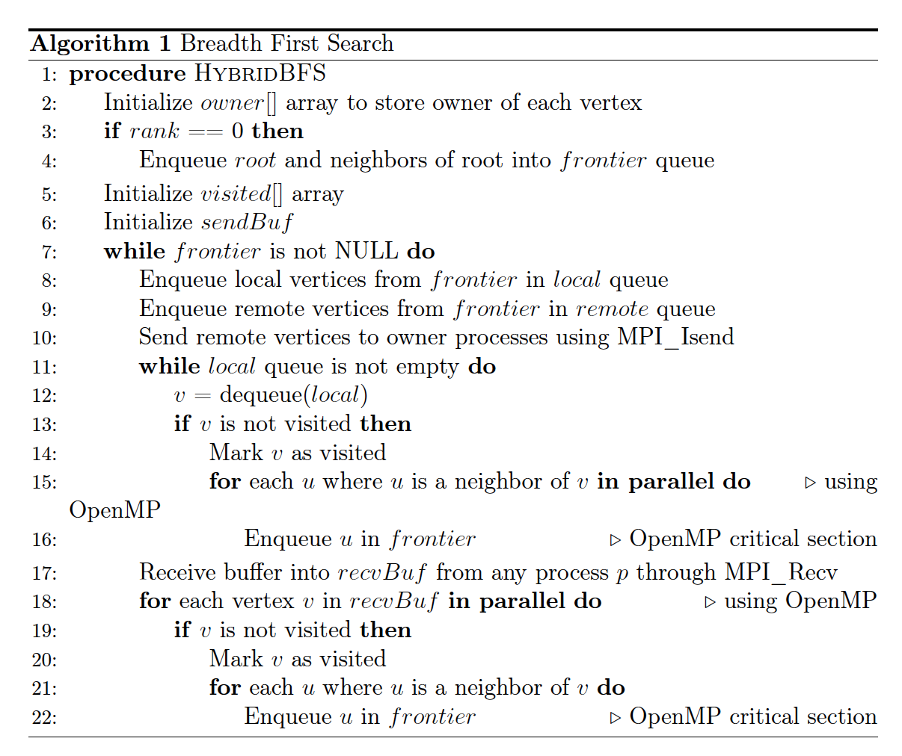

# Hybrid OpenMP-MPI Approach for Breadth First Search
An implementation of parallel BFS algorithm using hybrid OpenMP-MPI approach. Sample input graphs are provided in the input folder.

Algorithm:

